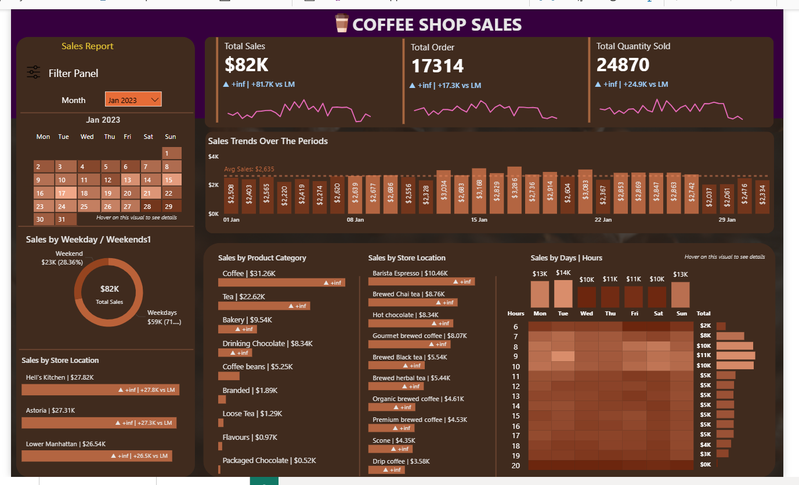

# ☕ Coffee Sales Analysis (MySQL + Power BI)

## 📘 Project Overview  
The **Coffee Sales Analysis Dashboard** provides a comprehensive view of coffee sales performance across various stores and product categories.  
This project demonstrates a complete **data analytics workflow** — from **data cleaning and KPI computation in MySQL** to **interactive visualization in Power BI**.  

The goal is to uncover insights into sales trends, customer behavior, and product performance to support business decision-making.

---

## 🧰 Tools & Technologies  
- **MySQL** → Data cleaning, transformation, and KPI calculation  
- **Power BI** → Dashboard design and interactive data visualization  
- **Excel / CSV** → Data storage and preprocessing  
- **SQL Techniques Used** → Joins, Aggregations, Subqueries, CTEs, Window Functions  

---

## 📊 Key Performance Indicators (KPIs)

### 🔹 1. Total Sales Analysis  
- Calculate total monthly sales.  
- Identify month-on-month (MoM) growth or decline.  
- Display difference between selected and previous month.  

### 🔹 2. Total Orders Analysis  
- Count total monthly orders.  
- Calculate MoM percentage change and difference.  

### 🔹 3. Total Quantity Sold Analysis  
- Sum total quantity sold each month.  
- Compute MoM growth or drop and absolute difference.

---

## 📈 Dashboard Visuals  

| Chart Type | Description |
|-------------|-------------|
| 📅 **Calendar Heat Map** | Color-coded daily sales intensity with tooltips for detailed metrics |
| 🕓 **Weekday vs Weekend Analysis** | Compares sales trends between weekdays and weekends |
| 📍 **Sales by Store Location** | Highlights MoM sales change for each store location |
| 📊 **Daily Sales with Average Line** | Bar chart showing daily sales vs. average line for comparison |
| 🛒 **Sales by Product Category** | Displays contribution of each category to total sales |
| ⭐ **Top 10 Products by Sales** | Identifies top-selling products based on total sales |
| 🔥 **Sales by Days and Hours** | Heat map of sales performance across hours and days |

---

## ⚙️ Project Workflow  

### **Step 1 — Data Cleaning & Analysis in MySQL**  
- Removed duplicate and missing records.  
- Standardized data formats for consistency.  
- Wrote SQL queries to calculate KPIs (Sales, Orders, Quantity).  
- Captured query outputs and screenshots for documentation.  

### **Step 2 — Data Visualization in Power BI**  
- Imported the cleaned MySQL dataset.  
- Created dynamic visualizations with month-wise slicers.  
- Used DAX measures for MoM calculations and average comparisons.  
- Designed a user-friendly and professional dashboard layout.

---

## 📸 Dashboard Preview  




---

## 📂 Project Structure  
```
📁 Coffee-Sales-Analysis-MySQL-Power-BI
│
├── 📄 Coffee_Sales_Queries.sql # All SQL queries for KPI calculation
├── 📄 Query_Documentation.pdf # Query results with screenshots
├── 📊 Coffee_Sales_Dashboard.pbix # Power BI dashboard file
├── 📁 Images/ # Dashboard and visuals screenshots
└── 📘 README.md # Project description file
```

---

## 💡 Key Insights
- Weekdays show higher average sales than weekends  
- Barista Espresso,Brewed Chai tea,Hot chocolate,Gourmet brewed coffee are top-selling products  
- Coffee,Tea are top product category
- Peak sales occur between **7 AM and 10 AM**
- Low sales occurs **6 AM and 8 PM** 

---

## 📸 Dashboard Preview
  


---

## 🧑‍💻 Author
**Mohammad Adnan**  
*Data Analyst | SQL | Power BI | Excel | Python*  

📧 24khanadnan93@gmail.com  
🔗 [LinkedIn Profile](https://www.linkedin.com/in/mohammad-adnan-59062a365/)  

---

## ⭐ How to Use
1. Clone or download this repository  
2. Open `.sql` files in **MySQL** to view queries and logic  
3. Open `.pbix` file in **Power BI** to explore the dashboard  
4. Use slicers (Month, Store, Category) to dynamically analyze performance  

---

## 🏁 Summary
This project showcases how **data-driven insights** can help businesses make informed decisions.  
It highlights **technical skills in SQL and Power BI**, along with **analytical thinking and data storytelling**.
